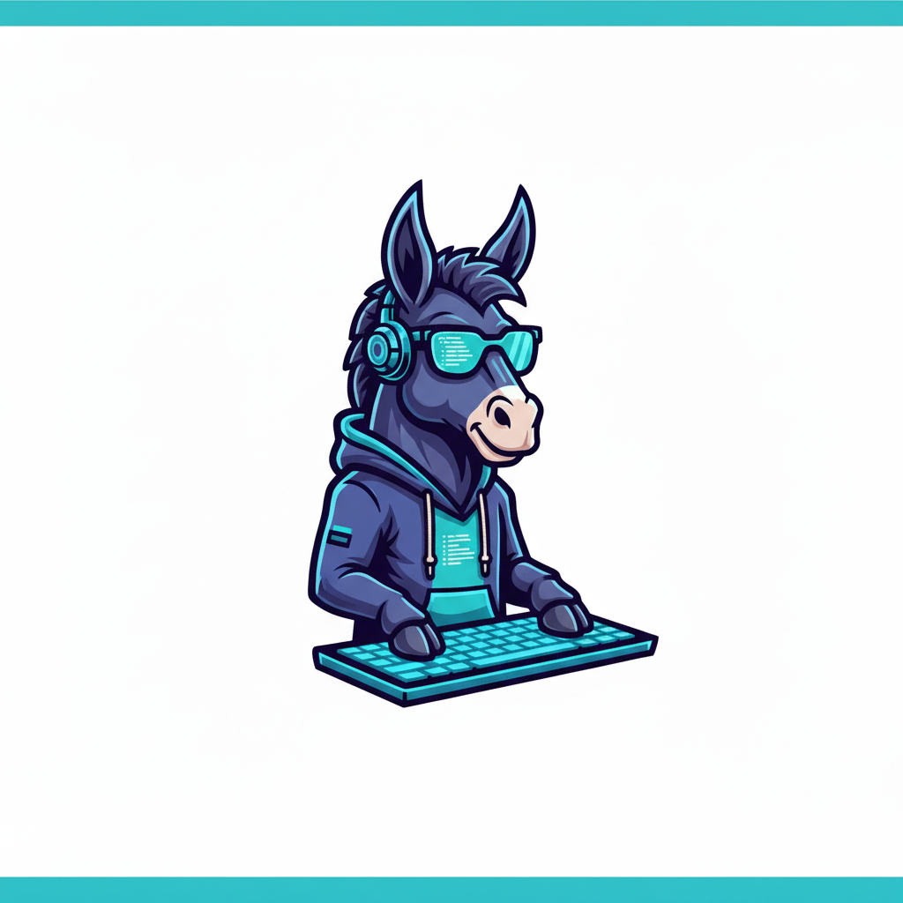

  

# 🫏 Mula

**M**achine Learning's **U**ltimate **L**earning **A**rchive

A clean, educational implementation of Machine Learning's most influential works using [JAX](https://github.com/google/jax).

## Models (WIP)

## 🏁 Getting Started (WIP)

---

## 🔗 Links

- [JAX Documentation](https://jax.readthedocs.io/)
- [Flax](https://flax.readthedocs.io/en/stable/)
- [Bonsai](https://github.com/jax-ml/bonsai/tree/main)
- [JAX AI Stack](https://github.com/jax-ml/jax-ai-stack?tab=readme-ov-file#jax-ai-stack)

