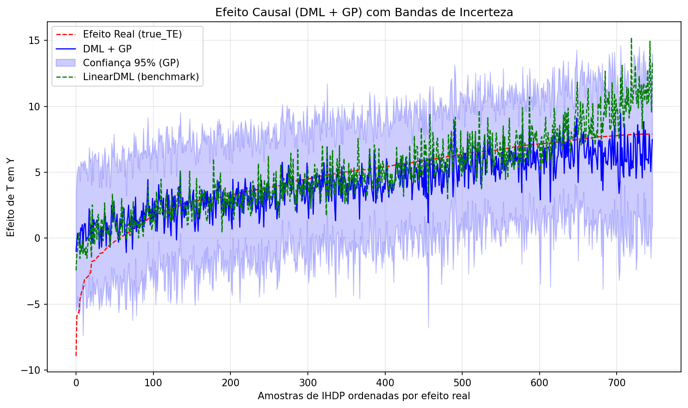
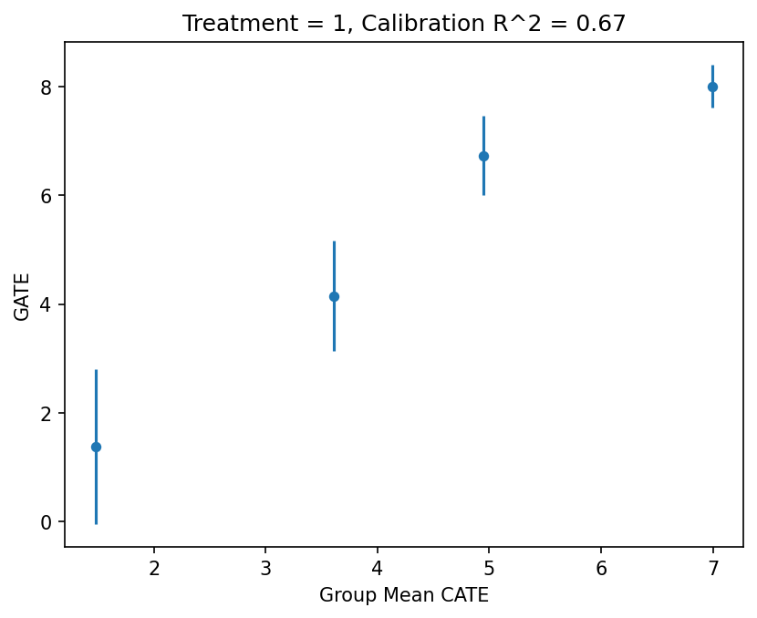

# Gaussian Process DML — Efeito causal com incerteza probabilística

Este projeto valida a combinação de dois mundos:

- **Double Machine Learning (DML)** [Chernozhukov et al. (2018)] para remover o viés de
  confounders observados via *orthogonalization* (residualização de `Y` e `T` por modelos
  de *machine learning* de primeira etapa);
- **Processo Gaussiano (GP)** como *modelo final* do DML, substituindo o modelo linear
  clássico por um estimador não-paramétrico que devolve, além da predição, uma distribuição
  completa sobre o efeito causal.

A pergunta que queremos responder: **o GP como modelo final consegue estimar o CATE
(Conditional Average Treatment Effect) com calibração probabilística útil, capturando
heterogeneidade sem inventar estruturas espúrias?**

Para validar isso usamos:

1. Um **DGP simulado** (`--dataset sim`) com ground truth conhecido
   (efeito monotônico negativo, τ(x) = -2 - 0.5x);
2. **IHDP** (Hill, 2011 — `--dataset ihdp-a` / `ihdp-b`), dataset semi-sintético com
   covariates reais e efeito verdadeiro conhecido — superfície A (efeito constante)
   e superfície B (heterogêneo), embutido no econml (sem downloads);
3. O framework oficial de validação **`econml.validate.DRTester`**
   [Dwivedi et al. (2020); Radcliffe (2007)] com métricas honestas em holdout:
   BLP, calibração R²C, Qini e AUTOC/TOC.

## Motivo para GP no lugar do modelo linear final

### 1. Interpretação probabilística do efeito causal (e robustez a confounders residuais)

O modelo linear final do DML entrega um **ponto**: τ̂(x) = β·x. Sem distribuição, sem
noção de "quanto eu duvido deste número para este indivíduo". O GP entrega
**posterior completo**: para cada unidade obtemos média e desvio-padrão, o que permite

- **score de confiança individual** — a banda de 95% do CATE (azul nos plots);
- **propagação honesta de incerteza** — ρ=95% apropriado para decisões do tipo
  "tratar só unidades onde o limite superior da banda indica ganho";
- testes de cobertura: o próprio script mede a **cobertura real** da banda contra o
  efeito verdadeiro (98.9%–100% nos datasets testados);
- out-of-sample extrapolation controlada: longe dos dados, o GP **recua para o prior
  e alarga a banda** em vez de progredir confiantemente como uma reta.

Sobre "mais robusto a confounders não observados": é correto com uma ressalva importante.
O DML ainda exige **confounding condicional** (unconfoundedness dado X). O que o GP
acrescenta é *robustez de segunda etapa*: quando o modelo de primeira etapa não consegue
absorver todo o confounding (resíduos de `Y` e `T` ainda carregam correlação), o GP
trata essa estrutura residual como **ruído correlacionado** (kernel `WhiteKernel` +
suavidade `RBF`), em vez de competir para explicá-la como sinal — o que tende a
**atenuar artifícios** em vez de amplificá-los como heterogeneidade falsa.
heterogeneidade falsa. O experimento do ihdp-a demonstra exatamente isso: o LinearDML
inventa heterogeneidade espúria (blp_p=0.16 com perturbações de ±4 no plot), enquanto o
GP ajustado com kernel ultra-suave fica estatisticamente quieto (blp_p=0.96) e encosta
no efeito real constante.

### 2. Controle de monotonicidade e modelagem de elasticidade

O kernel do GP é um **ponto de design explícito** — dá para codar conhecimento a priori
direto na covariância, coisa que um modelo linear não permite:

- **suavidade / monotonicidade esperada**: se você sabe que o efeito τ(x) varia
  continuamente com o contexto (elasticidade-preço, dose-resposta), o kernel `RBF`
  impõe funções C∞ — heterogeneidade brusca só aparece com evidência real nos dados.
  No ihdp-a isso significa "não inventar gradientes quando o efeito é plano";
- **tuning como parte do design**: o kernel fica exposto como hiperparâmetro central
  (`gp_dml/modeling.py` → `KERNEL_PRESETS`), e o script já vem com presets por tipo
  de dataset (efeito quase-constante para políticas homogêneas, curvatura fina para
  efeitos locais);
- **elasticidades não-lineares**: τ(x) linear é a restrição dura do DML clássico
  (o benchmark LinearDML). O GP captura τ(x) não-linear — curvatura, platôs,
  saturação — mantendo o pipeline residual livre de interferência;
- **benchmarks honestos**: como GP e LinearDML dividem os mesmos modelos de primeira
  etapa (LightGBM), qualquer diferença de métrica DRTester mede **só o final model**.

## Resultados (validação honesta, 20–25% holdout)

| Dataset | GP cal R²C | LinearDML cal R²C | conclusão |
|---|---|---|---|
| ihdp-b (heterogêneo, real) | 0.670 | 0.803 | ambos capturam heterogeneidade; GP quase empatado |
| ihdp-a (efeito constante, real) | **-0.112** | -0.692 | GP vence: kernel `smooth` evita heterogeneidade espúria |
| sim (DGP linear 1-D) | 0.024 | 0.027 | empate técnico (teto amostral do holdout binarizado) |

Como ler (`results/<dataset>/summary.csv`):

- `blp_pval > 0.05` ⇒ não há heterogeneidade detectável — desejado no ihdp-a;
- `qini_pval` / `autoc_pval` pequenos ⇒ ranking/priorização de unidades útil;
- `cal_r_squared` próximo de 1 ⇒ CATE bem calibrado em GATEs por quantil.

## Figuras geradas

O pipeline gera tudo em `results/<dataset>/`:

| arquivo | conteúdo |
|---|---|
| `effect_bands.png` | CATE: real vs DML+GP (com banda 95%) vs LinearDML — o plot central do projeto |
| `cal.png` | teste de calibração: GATE (DR outcome) vs GATE predito por grupo quantílico |
| `qini.png` | curva Qini com IC; área = ganho de priorização do modelo |
| `toc.png` | curva TOC/AUTOC com IC bootstrap; heterogeneidade capturada por ranking |
| `summary.csv` | métricas do DRTester para o DML+GP |
| `comparison.csv` | DML+GP vs LinearDML lado a lado |


*(sim: banda probabilística do GP e benchmark linear)*


*(calibração por GATEs no dataset real heterogêneo)*

## Como executar

```bash
uv run main.py                     # IHDP surface B (default, dataset real)
uv run main.py --dataset ihdp-a    # IHDP surface A — demonstra kernel 'smooth'
uv run main.py --dataset sim       # DGP simulado com T contínuo
uv run main.py --dataset sim --kernel default   # sobrepõe o preset
uv run main.py --plot              # abre janela ao final (padrão: salva PNG)
```

Arquitetura:

```
gp_dml/
├── data.py         # DGP simulado + IHDP (econml.data.dgps)
├── modeling.py     # kernels (presets), DML+GP, LinearDML benchmark
├── uncertainty.py  # GPScoreExtractor: CATE + desvio-padrão nativo do GP
└── validation.py   # DRTester: BLP / calibração / Qini / TOC, split honesto
```

## Estrutura do DML+GP (por que o GP vê `[T_res, X·T_res]`)

O econml treina o `model_final` sobre `cross_product([1, X], T_res)` — colunas
`[T_res, X·T_res]` — e o CATE de (T=1 vs T=0) é a diferença das predições nessas
features. A classe `GPScoreExtractor` (`gp_dml/uncertainty.py`) encapsula esse detalhe
e expõe `effect_and_std(X)`, `confidence_band(X)` e `coverage(...)`.

## Referências

- Chernozhukov, V. et al. *Double/Debiased Machine Learning for Treatment and
  Structural Parameters*. Econometrics Journal, 2018.
- Hill, J. L. *Bayesian Nonparametric Modeling for Causal Inference*. JCGS, 2011 (IHDP).
- Dwivedi, R. et al. *Stable Discovery of Interpretable Subgroups via Calibration in
  Causal Studies*, 2020 (teste de calibração / BLP).
- Radcliffe, N. *Using Control Groups to Target on Predicted Lift*, 2007 (QINI).
- Documentação: [econml.validate.DRTester](https://www.pywhy.org/EconML/_autosummary/econml.validate.DRTester.html),
  [EvaluationResults](https://www.pywhy.org/EconML/_autosummary/econml.validate.EvaluationResults.html)
